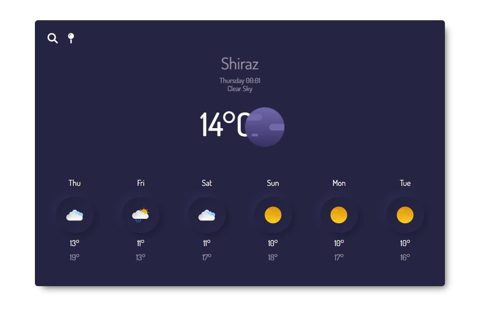

# Weather app

## Welcome to my project guys! 🙋‍♀️

## Table of contents

- [Overview](#overview)
  - [Screenshot](#screenshot)
  - [Links](#links)
- [My process](#my-process)
  - [Built with](#built-with)
  - [What I learned](#what-i-learned)
  - [Continued development](#continued-development)
  - [Useful resources](#useful-resources)
- [Author](#author)
- [Acknowledgments](#acknowledgments)


## Overview

Thanks for checking out this project and i did the best i could to provide you with the cleanest and accurate codes. I hope you enjoy it!
Remember that "Every day is a learning day", so let's checkout the requirements to start such project
This project provides a dynamic weather app which can show your current location weather and forecast future weather as well as any city that comes into your mind.


### Screenshot




### Links

- Live Site URL: [weather web application](https://gregarious-pithivier-0ba7f6.netlify.app/)

## My process

### Built with

- Semantic HTML5 markup
- CSS
- Bootstrap
- Desktop-first workflow
- js

### What I learned

This projects helped me being more familiar with the details of js and api concept, and i was able to use my js knowledge as well to create a responsive project.

To see parts of my codes and see how you can add code snippets, see below:

```html
  <div class="d-flex flex-column justify-content-center current-weather__description align-items-center mt-2 mb-3">
      <p id="weather-time" class="my-0 mx-2"></p>
      <p id="weather-type" class="my-0 mx-2"></p>
  </div>
```
```css
.weather-app-container {
  max-width: 810px;
  margin: 3rem auto;
  background-color: #252443;
  box-shadow: 8px 9px 14px -7px rgba(0, 0, 0, 0.67);
  -webkit-box-shadow: 8px 9px 14px -7px rgba(0, 0, 0, 0.67);
  -moz-box-shadow: 8px 9px 14px -7px rgba(0, 0, 0, 0.67);
  box-shadow: 8px 9px 14px -7px rgba(0, 0, 0, 0.67);
}
.fa-magnifying-glass,
.fa-map-pin {
  font-size: 20px;
  cursor: pointer;
}
```
```js
  const getForcast = (city) => {
    let apiKey = "f0bata7385ff184aeb7o2efc0a37f732";
    let apiEndpoint = ` https://api.shecodes.io/weather/v1/forecast`;
    let units = "metric";
    let apiUrl = `${apiEndpoint}?query=${city}&key=${apiKey}&units=${units}`;
    axios.get(apiUrl).then(displayForecast);    
  };
}
```

### Continued development

In my future projects, not only i am going to focus on improving my basic knowledge on frontend developments so as to create projects with great functionality and ui, but also I will also try to be much more familiar with UI design so as to better understand my clients needs and requirements.

### Useful resources

In order to do this project in a correct way you need to have a good knowledge of html and css, js and api.
- [SheCodes API Source](https://www.shecodes.io/learn/workshops/852/apis/149/weather) - You can access weather api in this site which was simplified by SheCodes team.

## Author

- Website - My website is under construction but you can find my works here : [Elle Famkar](https://github.com/ellefamkar)
- Twitter - [@Ellefamkar](https://www.twitter.com/ellefamkar)

Feel free to ask any questions come to your mind on my github account!

## Acknowledgments

I want to thank [SheCodes Team](https://www.shecodes.io/) for providing me this opportunity to learn more and be a frontend master.


**Have fun using this project!** 🚀